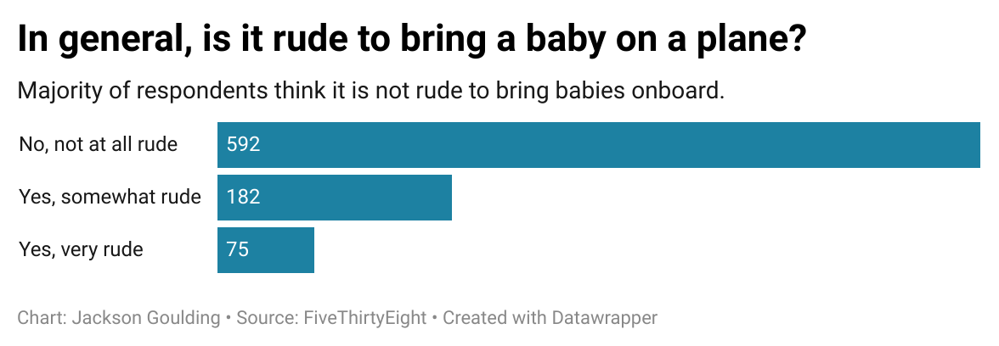

<h3>Why I Picked This Question</h3>

I selected this question because babies on planes seems to be the sterotypical rude airline behavior. Everybody seems to have their own horror story of a flight spoiled by the incessant wailing of a tempermental baby. As such, I was somewhat surprised to see that most people did not view bring a baby onboard an aiplane as a rude thing to do. Perhaps most people understand that sometimes parents have no choice but to bring their babies on a flight. Perhaps many of the respondents have children themselves, so they may sympathize with the plight of the parent who has to bring their baby onto their flight. I think it would be interesting to see how the number of children that a respondent has impacts their views on whether or not it's polite to bring a baby onboard.

Looking at my chart, we can see that the majority of people do not view bringing a baby on an airplane as a rude thing to do. it breaks down the respondents into three categories: those who find bringing babies on a plane to not be rude at all, those who find it somewhat rude, and those who find it very rude. Respondents were over twice as likely to say that bringing a baby on board was not rude than they were to answer that it is rude in any capacity. The least amount of people responded that it was a very rude thing to do.

